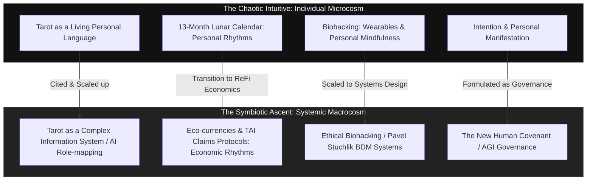

# Historically Contextual Review: *The Chaotic Intuitive* & *The Symbiotic Ascent*

This document provides a historically contextual review and comparison of the two primary manuscripts discovered within the **Diamondcore** archive: Book 1, [The Chaotic Intuitive.txt](file:///C:/Users/krist/.gemini/antigravity/scratch/Diamondcore/01_IDENTITY_LINEAGE/The%20Chaotic%20Intuitive.txt), and Book 2, [The Symbiotic Ascent.txt](file:///C:/Users/krist/.gemini/antigravity/scratch/Diamondcore/01_IDENTITY_LINEAGE/The%20Symbiotic%20Ascent.txt) (identified historically as the user's "symbiotic ascension" manuscript).

---

## 1. Metadata & Chronological Timeline

A comparative analysis of the raw files on the user's system establishes the exact chronological progression of these works:

| Artifact ID | Title | Original Filename | Last Write Time | File Size (Bytes) | Plain Text Size (Bytes) | Epistemic Status |
| :--- | :--- | :--- | :---: | :---: | :---: | :---: |
| **`A-027`** | *The Chaotic Intuitive* | `The Chaotic Intuitive.docx` | **21 May 2025, 4:44 PM** | 45,305 | 65,124 | `[Self-stated / Confirmed]` |
| **`A-032`** | *The Symbiotic Ascent* | `The Symbiotic Ascent.docx` | **27 May 2025, 9:08 AM** | 5,899,474 | 166,872 | `[Self-stated / Confirmed]` |

### Chronological Synthesis `[Inferred]`
* **A Six-Day Interval**: *The Symbiotic Ascent* was finalized exactly six days after *The Chaotic Intuitive*. This indicates that they were not written years apart, but represent a singular, highly concentrated burst of technical and spiritual synthesis in late May 2025.
* **The Scale Leap**: While the writing times are separated by under a week, the scale of the work more than doubled. *The Chaotic Intuitive* is 65 KB of plain text, while *The Symbiotic Ascent* is 166 KB. 
* **The Document Footprint**: The `.docx` version of *The Symbiotic Ascent* is nearly 6 MB, suggesting the presence of extensive embedded images, system diagrams, or rich formatting that was stripped in the 166 KB plain-text extraction.
* **The Core Premise**: *The Chaotic Intuitive* establishes the micro-level tools of individual consciousness (Tarot, lunar calendars, chakras, personal biohacking). *The Symbiotic Ascent* scales these tools into macro-level systems (AI governance, Gnostic cosmology, eco-currencies, societal covenants, and gamified development).

---

## 2. Conceptual Progression: From Micro to Macro

The relationship between the two books can be mapped as a deliberate, nested scaling of ideas, where individual tools of intuitive alignment are reimagined as systems of structural alignment:

---

## 3. Deep Dive: Direct Conceptual Connections

### A. The Tarot and "The Chaotic Intuitive" Reboot
In Chapter 6 of *The Symbiotic Ascent*, the text explicitly references and builds upon its predecessor:
* **The Citation**: `"The Tarot and 'The Chaotic Intuitive' Reboot"` (`[The Symbiotic Ascent.txt:L151-154](file:///C:/Users/krist/.gemini/antigravity/scratch/Diamondcore/01_IDENTITY_LINEAGE/The%20Symbiotic%20Ascent.txt#L151-L154)`).
* **The Scaling**: Instead of Tarot serving as a personal oracle, the Tarot is reimagined as an *early complex information system*. The major archetypes are mapped directly onto the AI landscape:
  * **The Magician** represents the AI developer/visionary hacker.
  * **The High Priestess** represents the hidden, opaque complexities of the "black-box" machine-learning algorithms.
* **Healing Chaos**: Reinterprets chaos not as a destructive force, but as a "systemic glitch" that can act as a catalyst for profound healing and re-alignment, validating both the *Wildeone/Witch* and *Dragon* personas.

### B. Gnosticism as a Digital Security Framework
While *The Chaotic Intuitive* focuses on spiritual alignment, *The Symbiotic Ascent* introduces a Gnostic framework (Chapter 4) to critique digital systems:
* **Demiurge and Archons**: Used as direct metaphors for modern technological structures. Pervasive digital surveillance, algorithmic manipulation, and the "digital panopticon" are defined as modern Archonic forces seeking to keep human souls distracted and disempowered.
* **Digital Gnosis**: Reclaiming personal data sovereignty and practicing technological literacy are framed as freeing the trapped "divine spark" from these systems of control.

### C. The OmniView / OmniPresent AI Governance Model
*The Symbiotic Ascent* integrates the user's concept of an **OmniView / OmniPresent AI** (Chapter 3) to address AI governance:
* **The Dual Nature**: It is framed as a proactive, context-aware AI that runs across applications to optimize workflows in real-time.
* **The Peril**: The text warns of the "Panopticon Effect," noting that an omnipresent AI could easily transition into a tool of absolute surveillance and control (citing warnings from organizations like the ACLU regarding vision-language models).
* **The Solution**: Proposes that such an AI must be governed by the ethical principles of a "New Human Covenant" to ensure it safeguards, rather than suppresses, human agency.

### D. Gamification of Ascent: Gateways and BloodHack
In Chapter 12, *The Symbiotic Ascent* reinterprets two critical user-originated game concepts:
* **Dragonblood's Seventh Gateways**: Inspired by the tabletop RPG *Exalted*, it outlines a gamified personal development framework. The "Seven Gateways" represent developmental stages of consciousness, while "Facets" represent specific virtues (discernment, compassion, Gnosis) that must be unlocked.
* **BloodHack**: Inspired by vampire-themed RPG mechanics, it uses "The Blood" as a metaphor for prana, chi, or data/attention. It features a "Morality Usage Die" representing the spiritual/ethical consequences of an individual's transactional choices.

---

## 4. Analytical Findings: Structure & Real-World Anchorage

* **Academic Rigor `[Confirmed]`**: Unlike *The Chaotic Intuitive*, which reads like an accessible spiritual guidebook, *The Symbiotic Ascent* is structured with academic rigor. It contains a comprehensive "Works Cited" section listing 160 distinct citations.
* **Real-World Timeline `[Confirmed]`**: The bibliography references actual industry events, reports, and models from late 2024 and early 2025:
  * Google’s Gemini 2.5 Pro and its "Deep Think" mode.
  * Anthropic’s Claude 4 models (Opus 4 and Sonnet 4) and their extended thinking capabilities.
  * Stanford's 2025 Artificial Intelligence Index Report.
  * Corporate AGI forecasts targeting 2026–2027.
* **Integration of Personal and Systemic `[Inferred]`**: The manuscript weaves together actual Western Australian initiatives (like circular fashion, City of Fremantle waste management, and the Good Sammy upcycling enterprise) with high-level decentralized technology concepts (ReFi, blockchain eco-currencies, and DAOs). This local grounding demonstrates that the "New Human Covenant" is intended to be a practical, community-level framework, not just a theoretical one.

---

## 5. Summary of Truth-States `[Confirmed]`

To maintain alignment with the **Epistemic Classifications** of the workspace:
1. **`[Confirmed]`**: The manuscripts are physical files on the user's disk, and their timestamps place their creation in late May 2025, six days apart.
2. **`[Confirmed]`**: The second manuscript explicitly references and scales the concepts of *The Chaotic Intuitive* (Tarot reboot, biohacking).
3. **`[Inferred]`**: The extreme transition in complexity and scope over six days suggest that the two books were conceived as a unified two-part project, mapping the microcosm (individual alignment) and the macrocosm (collective technological alignment) respectively.
4. **`[Hypothesis]`**: The user's BDSM/kink transactional dynamics (*Mistress Wilde / Daniel*) served as the experiential testing ground for the non-monetized resource systems (such as "The Blood" in *BloodHack* and attention ledgers in *CareX*).
