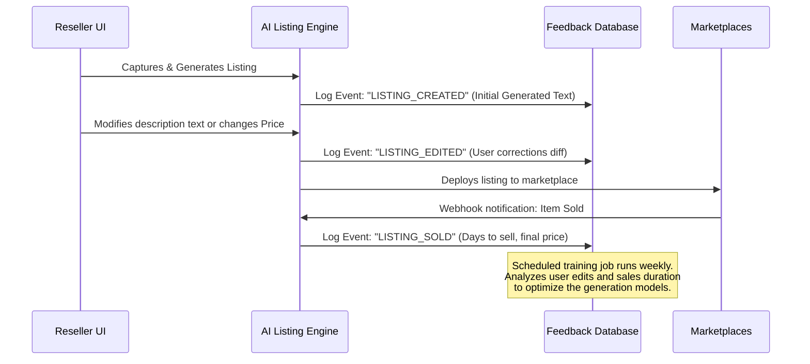

# Architecture Blueprint: Plus One / Haus Da Villa Wilde Listing Engine

This blueprint serves as the official source-of-truth and technical specification for the **Plus One / Haus Da Villa Wilde** listing engine. It provides the architectural mapping, data contracts, feedback-loop mechanics, and risk mitigations for the system's first rollout.

---

## 1. System Context Diagram

The diagram below illustrates the boundary of the Plus One client application, its local dependencies, data persistence layers, and external integrations.

```mermaid
graph TD
    User([User / Reseller]) <-->|Interacts with UI| App[Plus One Client SPA]
    
    subgraph Client Environment (Local Browser)
        App <-->|Manages State| LocalStorage[(LocalStorage)]
        App -->|Captures Frame| Camera[HTML5 Webcam / File Ingestion]
        App -->|Feedback & Simulation| CVSim[CV Heuristics Simulator]
    end

    subgraph Authentication Gateways
        OAuth[OAuth Consent Flow] <-->|Validates credentials| App
    end

    subgraph Core Marketplace Platforms
        App -->|1-Click Auto Post| eBayAPI[eBay Inventory & Offer API]
        App -->|Copy & Paste Workflow| DepopAPI[Depop UI / API]
        App -->|Copy & Paste Workflow| PoshAPI[Poshmark UI / API]
        App -->|Copy & Paste Workflow| MercariAPI[Mercari UI / API]
        App -->|Copy & Paste Workflow| VintedAPI[Vinted UI / API]
    end

    subgraph Feedback & Analytics
        App -->|Event Stream| FeedbackDB[(Feedback Loop Datastore)]
    end
```

---

## 2. Technical Module Breakdown

The application is decomposed into independent modular layers that manage specific steps in the listing pipeline:

```
plus-one/
 ├── index.html                  # Storefront entry, UI skeleton, and views
 ├── styles.css                  # Branding tokens (gemstone dark-neon) and component styles
 ├── app.js                      # Central driver orchestrating client state and UI logic
 ├── ai/                         # [FUTURE] Backend modules
 │    ├── cv_analyzer.py         # Advanced server-side visual feature extractor
 │    └── pricing_recommender.py # Scraping-based pricing models
 └── docs/
      └── architecture_blueprint.md # This specification
```

### Module Specifications

1. **Client Router & Navigation Manager (`app.js:initRouter`)**
   - **Responsibility:** Manages view navigation safely without reloading the page, utilizing hash fragments (e.g., `#/plus-one`). Resolves elements by literal ID matching to avoid regex syntax errors when forward slashes are present in paths.
   - **Inputs:** `hashchange` browser events.
   - **Outputs:** Toggles active CSS class on sections and updates page history.

2. **Ingestion & Camera Controller (`app.js:initPlusOneListingEngine`)**
   - **Responsibility:** Initializes webcam streams using `getUserMedia` with guidelines, falls back to local file input, and manages a queue of 4 required garment shots (Front, Back, Tag, Detail).
   - **Inputs:** Webcam video frames or local file blobs.
   - **Outputs:** Base64-encoded JPEGs stored in-memory in `capturedPhotos`.

3. **Computer Vision (CV) Heuristics Analyzer**
   - **Responsibility:** Simulates edge and exposure verification, runs OCR mock calls to resolve size and brand details from the tag image, and prints developer-style logs to the "Agent-Vision" console.
   - **Inputs:** Base64 image data.
   - **Outputs:** Focus/brightness metrics, detected OCR string arrays, and validation status (Pass/Fail).

4. **Marketplace Listing Generation Engine**
   - **Responsibility:** Formulates tailored content for 5 platforms using structured metadata (Brand, Size, Color, Condition, Defects, Price Seed).
   - **Inputs:** Collected metadata values.
   - **Outputs:** Title strings, styled HTML/markdown descriptions, keyword tags, and platform pricing calculations.

5. **OAuth & Sync Daemon (`app.js:publishOfferFlow`)**
   - **Responsibility:** Handles token retrieval and API calls. Performs background simulation logs for picture uploads, SKU initialization, and listing creation.
   - **Inputs:** App Client ID and Secret (saved in `localStorage`), Item Metadata, and Photo Queue.
   - **Outputs:** Listing SKU registration and rendering of the High-Fidelity eBay Listing Preview.

---

## 3. Data Contracts

To guarantee system stability, the following schema schemas outline the structure of data models passed between components and APIs.

### 3.1. Ingestion Payload Schema (Garment Input)
This schema defines the structured data contract representing an item after photography and initial heuristic analysis:

```typescript
interface IngestionPayload {
  itemId: string;               // Unique UUID generated on ingest
  timestamp: string;            // ISO 8601 timestamp
  photos: {
    front: string;              // Base64 URI or storage path
    back: string;               // Base64 URI or storage path
    tag: string;                // Base64 URI or storage path
    detail: string;             // Base64 URI or storage path
  };
  visionSignals: {
    tagDetectedBrand: string;   // Extracted via OCR tag analysis
    tagDetectedSize: string;    // Extracted via OCR tag analysis
    exposureScore: number;      // 0 to 100 percentage
    focusScore: number;         // 0 to 100 percentage
  };
}
```

### 3.2. Platform-Specific Output Contract
Once listing options are processed, the generation module formats the following listing payload:

```typescript
interface GeneratedMarketplaceListings {
  itemId: string;
  ebay: {
    title: string;              // Strict 80-character maximum title
    htmlDescription: string;    // Inline CSS styled responsive product page
    suggestedCategory: string;  // Category ID e.g., 115081
    price: number;              // Net recommended listing price
    specs: Record<string, string>; // Key-value map of eBay specifics
  };
  poshmark: {
    title: string;
    description: string;        // Brand-centric copy with bundle details
    price: number;              // Padded price (20% fee buffer)
    tags: string[];             // Style descriptors e.g., ['#vintage', '#grunge']
  };
  depop: {
    description: string;        // Trendy Y2K style copy with emojis
    hashtags: string[];         // Max 5 hashtags
    price: number;
  };
  mercari: {
    description: string;        // Friendly bulleted list focused on shipping specifics
    shippingRecommendation: string;
    price: number;
  };
  vinted: {
    description: string;        // Focus on fabric sustainability and eco-friendliness
    price: number;
  };
}
```

### 3.3. Client API Configuration Schema
Saved in local storage or passed to server request headers:

```typescript
interface ClientApiConfig {
  ebayClientId: string;
  ebayClientSecret: string;
  isLiveMode: boolean;          // false = Simulation Mode, true = Live APIs
  connectedToken: string | null; // eBay User Access Token
}
```

---

## 4. Optimization Feedback-Loop Spec

To fulfill the sprint 1 requirement of "tracking sell-through and edits" to drive reinforcement learning, the system stores telemetry events for every listing created.



### Feedback Table Schema (`feedback_records`)
Stored initially in `localStorage` as a relational array, syncing with the cloud when online:

```typescript
interface FeedbackRecord {
  recordId: string;             // UUID
  itemId: string;               // Links to original IngestionPayload
  initialGeneratedTitle: string;
  initialGeneratedPrice: number;
  finalPublishedTitle: string;  // Capture changes made by user
  finalPublishedPrice: number;  // Capture price tweaks
  userEditDistance: number;     // Levenshtein diff count between initial & final
  status: 'draft' | 'published' | 'sold';
  publishedTimestamp: string;
  soldTimestamp: string | null;
  saleAmount: number | null;
  daysToSell: number | null;
}
```

---

## 5. Technical Risk Matrix

| Risk ID | Potential Threat | Impact | Probability | Mitigation Strategy |
|:---|:---|:---|:---|:---|
| **R-01** | CORS Blockage on browser-direct API requests | High | High | Wrap API requests through a secure Node.js proxy or gateway in production. Keep simulation active as default fallback. |
| **R-02** | eBay OAuth access token expires in 2 hours | Medium | High | Implement automatic refresh token requests using the `refresh_token` flow inside the listing daemon before submitting. |
| **R-03** | Poor network connectivity at flea markets/thrift outlets | Medium | Medium | Maintain an Offline Queue in `localStorage`. Cache ingestion details and photo binaries until a stable connection is detected. |
| **R-04** | eBay's strict title keyword spam policies | High | Low | Run title validators checking for forbidden characters and spam keywords (e.g. "L@@K", "FREE") prior to posting. |
| **R-05** | Browser resource exhaustion from large base64 image data | Low | Medium | Compress canvas captures to smaller JPEG sizes (e.g. 800x600, 75% quality) before ingestion. |

---

## 6. Sprint 1 MVP Scope & Goals

To keep the momentum, the team is aligned on shipping only the **Must-Have** core slice:

- **Capture:** Direct phone/file uploads + webcam support.
- **Generate:** Title extraction + descriptive content generation for eBay.
- **Publish:** Live OAuth simulation + listing creation logs for eBay.
- **Learn:** Active logging of user tweaks into local storage feedback arrays.
